# Cascade Data Model (Convex)

**Scope**: Complete System Map (100% Coverage).
This document visualizes the entire multi-tenant platform architecture.

## 🗺️ High-Level Context Map

## 1. Organization & Hierarchy

_Multi-tenancy and Access Control._

```mermaid
erDiagram
    COMPANY ||--o{ WORKSPACE : "has depts"
    COMPANY ||--o{ COMPANY_MEMBER : "staffs"
    WORKSPACE ||--o{ TEAM : "organizes"
    TEAM ||--o{ PROJECT : "owns"

    COMPANY {
        id _id PK
        string slug "acme-corp"
        json settings "Billing/Hours"
    }

    COMPANY_MEMBER {
        id _id PK
        id userId FK "→ User"
        enum role "OWNER|ADMIN|MEMBER"
    }

    WORKSPACE {
        id _id PK "e.g. Engineering"
        string slug
    }

    TEAM {
        id _id PK "e.g. Frontend Team"
        id leadId FK "→ User"
    }

    USER {
        id _id PK
        string name
        string email
        string avatarUrl
    }
```

## 2. Project Management

_Sprints, Issues, and Actions._

```mermaid
erDiagram
    PROJECT ||--o{ SPRINT : "cycles"
    PROJECT ||--o{ ISSUE : "tasks"
    PROJECT ||--o{ LABEL : "tags"
    PROJECT ||--o{ SAVED_FILTER : "views"
    ISSUE ||--o{ ISSUE_COMMENT : "discusses"
    ISSUE ||--o{ ISSUE_LINK : "relates/blocks"


    PROJECT {
        id _id PK
        string key "PROJ"
        id workspaceId FK "→ Workspace"
        enum boardType "KANBAN|SCRUM"
        json workflowStates "[{id, name, order}]"
    }

    SPRINT {
        id _id PK
        string name
        enum status "ACTIVE|FUTURE"
        id projectId FK "→ Project"
    }

    SAVED_FILTER {
        id _id PK
        string name
        id userId FK "→ User"
        boolean isPublic
        json filters "{status:['Done']}"
    }

    ISSUE {
        id _id PK
        string title
        enum type "STORY|BUG|EPIC"
        id assigneeId FK "→ User"
        id workspaceId FK "→ Workspace (Global)"
        id sprintId FK "→ Sprint"

        float64[] embedding "Vector Search"
    }

    LABEL {
        id _id PK
        string name
        string color
    }

    ISSUE_LINK {
        id _id PK
        id fromIssueId FK "→ Issue"
        id toIssueId FK "→ Issue"
        enum type "BLOCKS|RELATES"
    }



    ISSUE_COMMENT {
        id _id PK
        id issueId FK "→ Issue"
        id authorId FK "→ User"
        string body "ProseMirror"
        timestamp createdAt
    }
```

## 3. Agency & Time Tracking

_Billing, Employment Types, and Compliance._

## 4. AI & Meeting Intelligence

_The "Read.ai" Competitor Layer._

## 5. Developer Ecosystem

_GitHub Integration and API Keys._

```mermaid
erDiagram
    GITHUB_REPO ||--o{ GITHUB_PR : "syncs"
    GITHUB_REPO ||--o{ GITHUB_COMMIT : "syncs"
    ISSUE ||--o{ GITHUB_PR : "linked"

    GITHUB_REPO {
        id _id PK
        string repoFullName "owner/repo"
        boolean syncPRs
        id projectId FK "→ Project"
    }

    GITHUB_PR {
        id _id PK
        int prNumber
        string title
        enum state "OPEN|MERGED"
    }

    GITHUB_COMMIT {
        id _id PK
        string hash "SHA"
        string message
        id authorId FK "→ User"
        timestamp committedAt
    }
```

## 6. Knowledge Base

_Notion-like Documents._

```mermaid
erDiagram
    DOCUMENT ||--o{ DOCUMENT_VERSION : "history"
    PROJECT ||--o{ DOCUMENT : "has wiki"

    DOCUMENT {
        id _id PK
        string title
        boolean isPublic
        id createdBy FK "→ User"
    }

    DOCUMENT_VERSION {
        id _id PK
        int version
        json snapshot "ProseMirror Data"
    }
```

## 7. CRM & Automation

_Bookings, Webhooks, and Event Triggers._

```mermaid
erDiagram
    BOOKING_PAGE ||--o{ BOOKING : "schedules"
    WEBHOOK ||--o{ WEBHOOK_EXEC : "logs"
    AUTOMATION_RULE ||--o{ PROJECT : "automates"
    USER ||--o{ AVAILABILITY_SLOT : "defines"
    USER ||--o{ CALENDAR_EVENT : "attends"

    BOOKING_PAGE {
        id _id PK
        string slug "cal.com/mike"
        int duration
    }

    WEBHOOK {
        id _id PK
        string url
        string[] events "issue.created"
    }

    AUTOMATION_RULE {
        id _id PK
        string trigger "status_changed"
        string action "set_assignee"
    }

    CALENDAR_EVENT {
        id _id PK
        string title
        timestamp startTime
        timestamp endTime
        enum type "MEETING|TIMEBLOCK"
    }

    AVAILABILITY_SLOT {
        id _id PK
        enum dayOfWeek "MONDAY..."
        string startTime "09:00"
        string endTime "17:00"
    }


    BOOKING {
        id _id PK
        id bookingPageId FK "→ BookingPage"
        timestamp startTime
        string guestEmail
    }

    WEBHOOK_EXEC {
        id _id PK
        id webhookId FK "→ Webhook"
        json payload
        int statusCode
        timestamp createdAt
    }
```

## 8. System & Templates

_Domains: Config, Notifications, Sync, Templates_

This domain handles user notifications, offline synchronization, and reusable templates.

```mermaid
erDiagram
    %% System
    USER ||--o{ NOTIFICATION : "receives"
    USER ||--o{ OFFLINE_SYNC_QUEUE : "syncs"
    USER ||--o{ UNSUBSCRIBE_TOKEN : "manages"

    %% Templates
    PROJECT_TEMPLATE ||--o{ PROJECT : "instantiates"
    ISSUE_TEMPLATE ||--o{ ISSUE : "instantiates"
    DOCUMENT_TEMPLATE ||--o{ DOCUMENT : "instantiates"

    NOTIFICATION {
        id _id PK
        id userId FK "→ User"
        string type "MENTION|ASSIGNED"
        boolean isRead
        id issueId FK "→ Issue (Optional)"
    }

    OFFLINE_SYNC_QUEUE {
        id _id PK
        string mutationType "issues.update"
        string mutationArgs "JSON"
        enum status "PENDING|SYNCING|FAILED"
    }

    UNSUBSCRIBE_TOKEN {
        id _id PK
        id userId FK "→ User"
        string token "Hashed"
        string reason
        timestamp createdAt
    }

    PROJECT_TEMPLATE {
        id _id PK
        string name
        string category "SOFTWARE|MARKETING"
        json workflowStates "Default flow"
    }

    ISSUE_TEMPLATE {
        id _id PK
        enum type "BUG|STORY"
        string titleTemplate
        string descriptionTemplate
    }

    DOCUMENT_TEMPLATE {
        id _id PK
        string name
        string category
        json content "ProseMirror"
    }
```

## 9. Internal Libraries

_Domains: Auth, Rate Limiting, Presence_

These tables are managed by `@convex-dev` libraries, not application logic.

```mermaid
erDiagram
    %% Auth
    AUTH_SESSION ||--|| USER : "authenticates"
    AUTH_ACCOUNT ||--|| USER : "links"

    %% System
    RATE_LIMIT ||--o{ USER : "throttles"
    AGGREGATE ||--o{ PROJECT : "caches counts"

    AUTH_SESSION {
        id _id PK
        id userId FK "→ User"
        timestamp validUntil
    }

    AUTH_ACCOUNT {
        id _id PK
        id userId FK "→ User"
        string provider "google|github"
        string accountId
    }

    RATE_LIMIT {
        id _id PK
        string key "user:123"
        int count
        timestamp resetTime
    }

    AGGREGATE {
        id _id PK
        string namespace "projects.count"
        string key
        int value
    }

    PRESENCE {
        id _id PK
        string room "doc:123"
        id userId FK "→ User"
        timestamp updated
    }
```

