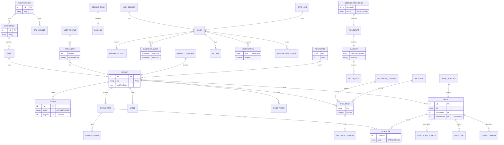

# Cascade Grand Unified Model

**The Master Schema**

This document provides a single, zoomed-out view of the entire Cascade application state.
It combines all 9 domains (PM, CRM, AI, Dev, etc.) into one massive Entity Relationship Diagram.

