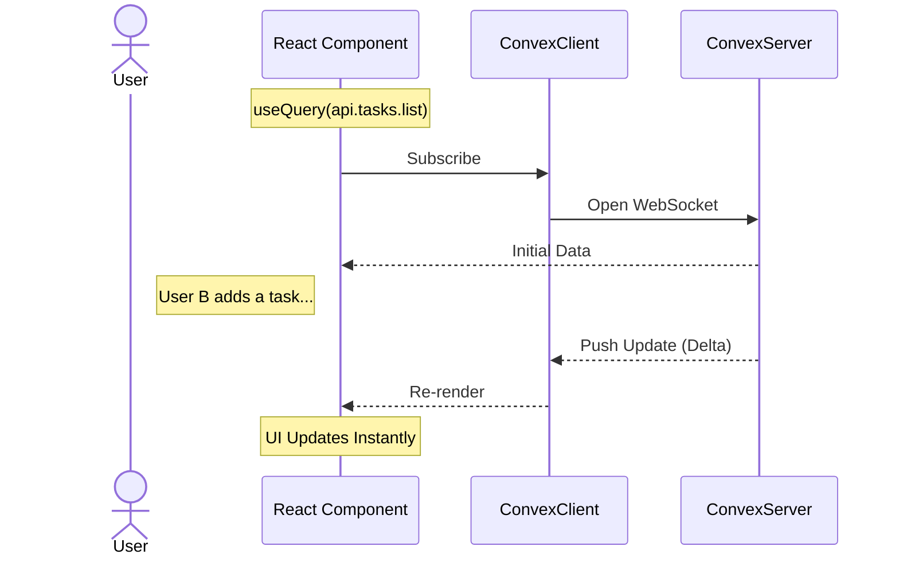
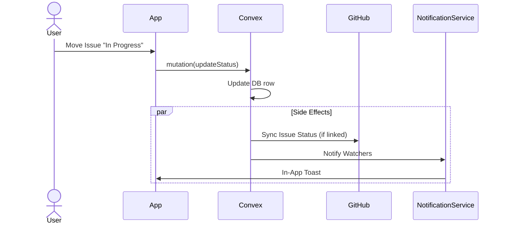
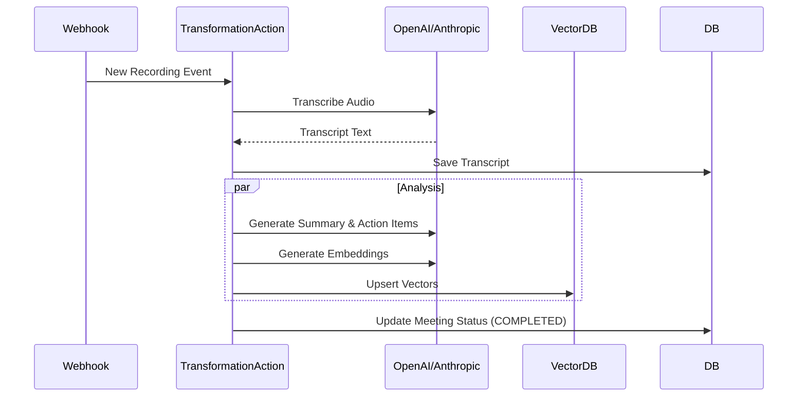
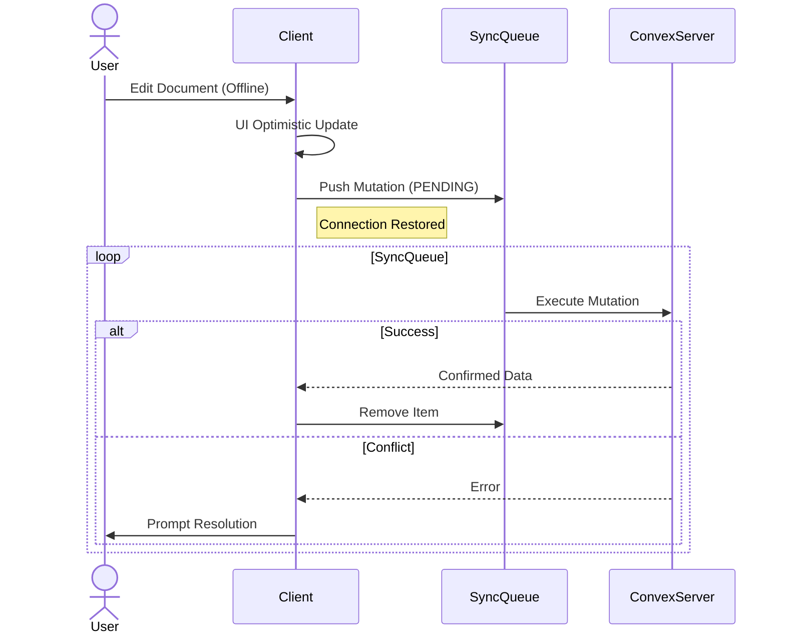

# Cascade Workflows & Performance (Convex)

## 1. The "Real-Time" React Loop

_Convex handles data subscriptions automatically._



## 2. Rapid Prototyping Workflow (Solo Dev)

Cascade is optimized for speed. No migration files.

1.  **Edit Schema**: Add field to `convex/schema.ts`.
    ```typescript
    tasks: defineTable({
      assignedTo: v.optional(v.id("users")), // Added field
    });
    ```
2.  **Save**: `npx convex dev` automatically pushes changes.
3.  **Use**: Field is immediately available in `ctx.db` in your functions.

## 3. Project Management Lifecycle

_Domain: Project Management_

The core loop from Issue Creation to Completion.



## 4. AI Processing Pipeline

_Domain: AI & Meeting Intelligence_

Asynchronous processing of meeting recordings.



## 5. Offline Sync & Optimistic UI

_Domain: System_

How Cascade handles offline edits without conflicts.



## 6. Indexing in Convex

Indexes are defined directly on the table definition in schema.ts.

### Best Practices

- **Search**: Use `.searchIndex` for full-text search (e.g., Task Titles).
- **Vector**: Use `.vectorIndex` for AI embeddings.
- **Equality**: Use `.index` for exact matches (e.g., `by_owner`).

```typescript
// convex/schema.ts
export default defineSchema({
  tasks: defineTable({ ... })
    .index("by_owner", ["ownerId"])           // q.withIndex("by_owner")
    .searchIndex("search_title", {            // q.withSearchIndex("search_title")
       searchField: "title",
       filterFields: ["ownerId"]
    }),
});
```
